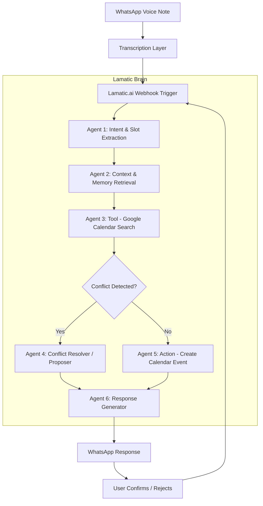

# Voxa: Detailed System Design & Agentic Logic

This document outlines the internal logic of the **Voxa** system, specifically how **Lamatic.ai** orchestrates various agents to provide a seamless scheduling experience.

## 🧠 The Lamatic Flow Diagram (Conceptual)



---

## 🕵️ Agent Definitions

### 1. Intent & Slot Extraction Agent (LLM Node)
- **Role**: Understands what the user wants.
- **Input**: "Book a meeting with Shiv today at nine thirty at night."
- **Output (Structured)**:
  ```json
  {
    "intent": "schedule_meeting",
    "participant": "Shiv",
    "date": "2026-02-10",
    "time": "21:30",
    "duration": null 
  }
  ```

### 2. Context & Memory Agent (LLM + Vector DB Node)
- **Role**: Refines the request based on history.
- **Action**: Queries Lamatic Memory for `user_id: abhishek`.
- **Logic**: "Abhishek always books 30-minute meetings with Shiv."
- **Enriched Slot**: `{ "duration": "30m" }`

### 3. Calendar Reasoning Agent (Tool Node)
- **Role**: Interacts with the real world.
- **Tool**: `google_calendar.list_events(timeMin: 21:30, timeMax: 22:00)`
- **Observation**: "Found event: 'Dinner with Mom' from 21:00 to 22:00."

### 4. Conflict Resolver Agent (LLM Node)
- **Role**: Proactive problem solver.
- **Reasoning**: "Subject is busy until 10 PM. Check 10 PM to 10:30 PM."
- **Action**: Queries Calendar again for 10 PM.
- **Result**: "Slot is free."

### 5. Response Generator (LLM Node)
- **Role**: Conversational tone & confirmation.
- **Tone**: Professional yet friendly.
- **Output**: "You have 'Dinner with Mom' until 10 PM. Should I schedule Shiv for 10:00 PM instead?"

---

## 💾 Memory Schema (Lamatic Vector Store)

Each user has a persisted memory profile:

| Key | Value Example | Description |
|-----|---------------|-------------|
| `preferred_duration` | `30m` | Default meeting length |
| `working_hours` | `09:00 - 20:00` | Soft limits for scheduling |
| `frequent_contacts` | `["Shiv", "Rahul", "Priya"]` | Name matching index |
| `last_reschedule_reason` | `Late night conflict` | Learns from previous manual fixes |

---

## 🛠️ Error Handling & Edge Cases

1. **Noise in Audio**: If transcription confidence is low, the **Response Agent** asks for clarification: "I didn't quite catch the time. Was it 9:00 or 9:30?"
2. **Missing Contacts**: If "Shiv" is not in the directory, Voxa asks: "I don't have Shiv's email. Can you say it or send a text?"
3. **Double Booking**: Voxa *never* double-books without explicit user override.

---

## 🎯 Why Lamatic?
"Without Lamatic, this would require 500+ lines of complex state management and retry logic. With Lamatic, I can focus on the **Reasoning Loop** and **Tool Orchestration**, making the system truly agentic rather than just a scripted bot."
